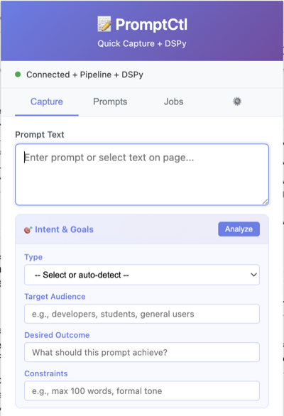
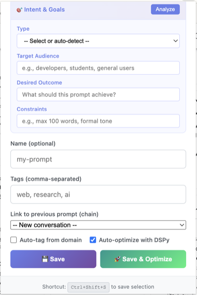
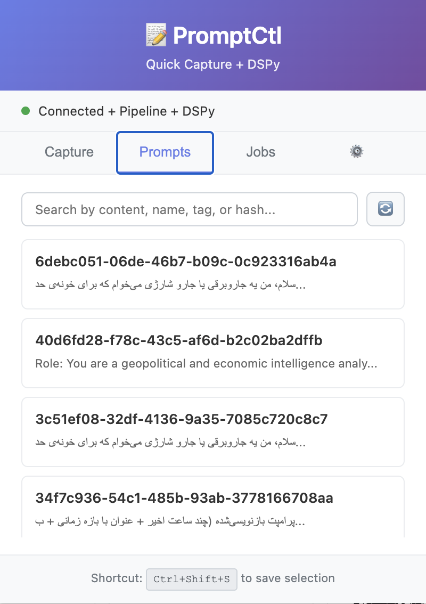
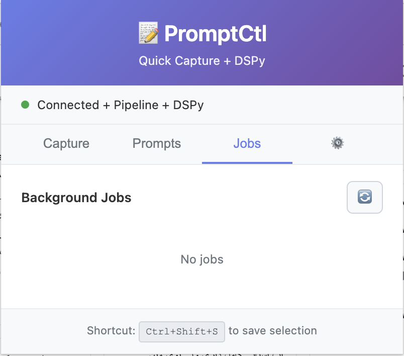
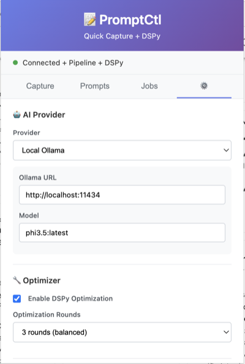
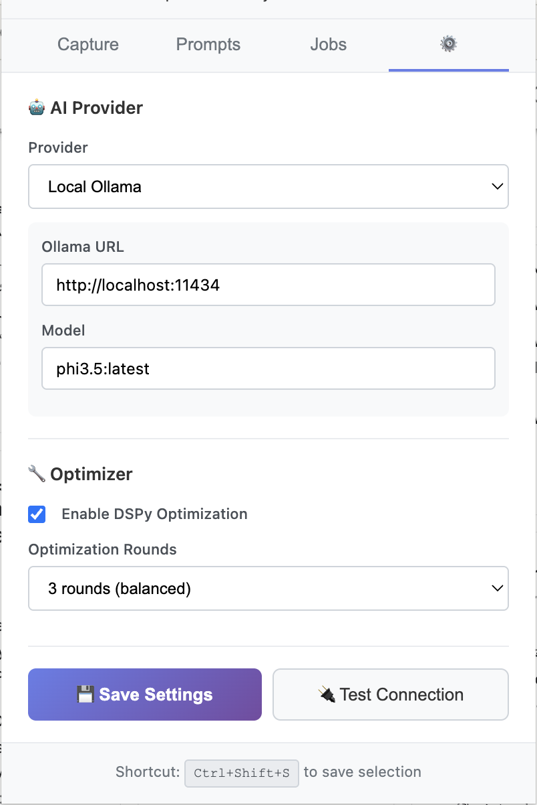

# PromptCtl Quick Capture

**Version:** 1.0.0  
**Status:** Production Ready

## 1. Abstract

PromptCtl Quick Capture is a browser extension for capturing, organizing, and optimizing AI prompts. It connects to a local backend server that stores prompts and optionally optimizes them using DSPy.

## 2. Architecture

```
┌─────────────────┐     HTTP/JSON      ┌─────────────────┐
│  Browser Ext.   │ ◄──────────────►   │  promptctl.py   │
│  (Chrome/FF)    │    localhost:8741  │  FastAPI Server │
└─────────────────┘                    └────────┬────────┘
                                                │
                                       ┌────────▼────────┐
                                       │   Local Ollama  │
                                       │   (Optional)    │
                                       └─────────────────┘
```

**Components:**
- `extension/` — Browser extension (Manifest V3)
- `promptctl.py` — FastAPI backend server
- `core/` — Backend modules (storage, DSPy optimization)

## 3. User Interface Reference

### 3.1 Capture Tab



**Header:**
- Application title with connection status indicator (green = connected)
- Status shows active features: "Connected + Pipeline + DSPy"

**Prompt Text:**
- Large text area for entering or pasting prompt text
- Supports selection capture via keyboard shortcut (Ctrl+Shift+S / Cmd+Shift+S)

### 3.2 Capture Form (Intent & Goals)



**Intent & Goals Section:**
- **Analyze** button — Auto-detect prompt type and metadata
- **Type** — Prompt category (auto-detect or manual selection)
- **Target Audience** — Intended users (developers, students, general)
- **Desired Outcome** — Expected result from the prompt
- **Constraints** — Limitations (word count, tone, format)

**Metadata:**
- **Name** — Optional identifier for the prompt
- **Tags** — Comma-separated labels for organization
- **Link to previous prompt** — Chain prompts into conversations

**Options:**
- **Auto-tag from domain** — Extract tags from current website
- **Auto-optimize with DSPy** — Enable automatic optimization

**Actions:**
- **Save** — Store prompt without optimization
- **Save & Optimize** — Store and queue for DSPy optimization

### 3.3 Prompts Tab



**Search:**
- Filter by content, name, tag, or hash
- Refresh button to reload from server

**Prompt List:**
- Each prompt displays UUID and preview text
- Click to view/edit prompt details
- Supports multilingual content (Persian, English, etc.)

### 3.4 Jobs Tab



**Background Jobs:**
- Lists active DSPy optimization jobs
- Refresh button to check job status
- Shows "No jobs" when queue is empty

### 3.5 Settings Tab




**AI Provider:**
- **Provider** — Select backend (Local Ollama, OpenAI, etc.)
- **Ollama URL** — Endpoint for local Ollama instance
- **Model** — LLM model name (e.g., phi3.5:latest)

**Optimizer:**
- **Enable DSPy Optimization** — Toggle DSPy pipeline
- **Optimization Rounds** — Number of optimization iterations
  - 1 round (fast)
  - 3 rounds (balanced)
  - 5 rounds (thorough)

**Actions:**
- **Save Settings** — Persist configuration
- **Test Connection** — Verify backend connectivity

## 4. Installation

### 4.1 Backend Server

```bash
git clone https://github.com/OmidZamani/promptctl.git
cd promptctl
pip install -r requirements.txt
python promptctl.py
```

Server runs on `http://localhost:8741`.

### 4.2 Browser Extension

**Chrome:**
1. Navigate to `chrome://extensions/`
2. Enable "Developer mode"
3. Click "Load unpacked"
4. Select the `extension/` directory

**Firefox:**
1. Navigate to `about:debugging#/runtime/this-firefox`
2. Click "Load Temporary Add-on"
3. Select `extension/manifest.json`

### 4.3 Docker

```bash
docker-compose up -d
```

## 5. Configuration

| Variable | Default | Description |
|----------|---------|-------------|
| `PROMPTCTL_HOST` | `0.0.0.0` | Server bind address |
| `PROMPTCTL_PORT` | `8741` | Server port |
| `OLLAMA_URL` | `http://localhost:11434` | Ollama API endpoint |

Prompts stored in `~/.promptctl/prompts/` as JSON files.

## 6. Keyboard Shortcuts

| Shortcut | Action |
|----------|--------|
| `Ctrl+Shift+S` (Win/Linux) | Save selected text as prompt |
| `Cmd+Shift+S` (Mac) | Save selected text as prompt |

## 7. Security Considerations

1. **Local-only by default** — Server binds to localhost
2. **No telemetry** — No data sent to external services
3. **API tokens** — Store in environment variables, never in code
4. **Ollama** — Runs locally; no cloud dependency

## 8. License

MIT License
